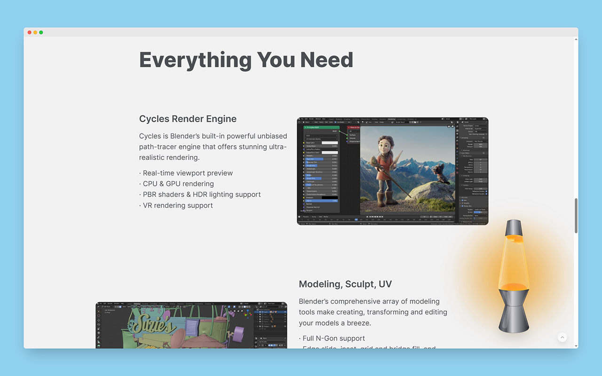
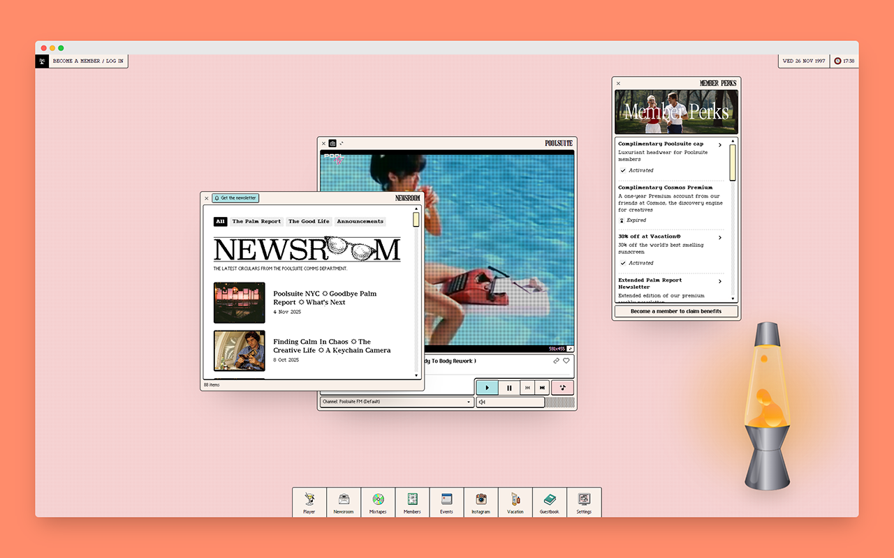
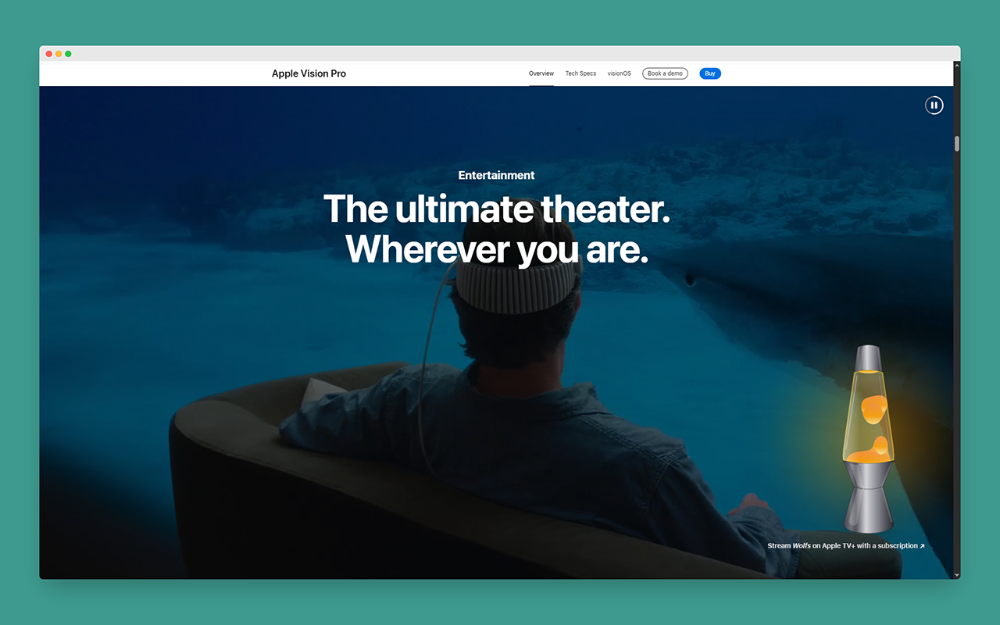

# RetroFlow - 拟真物理熔岩灯 (Physics Lava Lamp)

  
   
  <h3>为你的浏览器注入复古霓虹灵魂</h3>
  

    Inject retro neon soul into your browser 
    ブラウザにレトロなネオンソウルを
  

---

## 📖 简介 (Introduction)
**RetroFlow** 是一款带有物理惯性与互动小游戏的桌面熔岩灯浏览器扩展。
区别于普通的静态装饰，本插件引入了**实时物理引擎**。当你拖动它时，灯身会根据移动速度产生真实的物理倾斜；每一个熔岩球的拉伸、变形与融合都经过精密计算。

## ✨ 核心特性 (Features)
- 🌊 **极致拟真物理**：独有的流体粘性算法，模拟蜡块受热时的拉伸与融合。
- ⚖️ **动态惯性反馈**：拖拽时灯身会根据速度产生物理倾斜，手感沉甸甸。
- 🔥 **Ignition 点火游戏**：最小化后化为余烬。划动火柴，三连击重新点燃桌面！
- 🎧 **沉浸式声光**：包含真实的擦火柴音效、天使光圈与流光文字提示。
- 🎨 **完全自定义**：支持彩虹流光、暗夜枪灰等多种配色。

## 📸 效果演示 (Showcase)

  
    
  
    
  

## 📥 如何安装 (How to Install)

### 方式一：Edge 商店安装 (推荐)
*(审核中，敬请期待...)*

### 方式二：手动安装 (免费)
1. 在本页面的右侧点击 **"Releases"**，下载最新的 `.zip` 文件。
2. 打开浏览器扩展管理页面 (`edge://extensions` 或 `chrome://extensions`)。
3. 开启右上角的 **"开发人员模式" (Developer mode)**。
4. 将下载的 `.zip` 文件直接拖入浏览器窗口即可。

## 🛠️ 技术栈 (Tech Stack)
- React + TypeScript
- Vite
- Tailwind CSS
- SVG Filters (Gooey Effect)

 

---

<!-- 英文版折叠区域 -->

  
<h2>🇺🇸 English Version (Click to Expand)</h2>

## 📖 Introduction
**RetroFlow** is a desktop lava lamp browser extension powered by physics inertia and interactive mini-games.
Unlike ordinary static decorations, this extension introduces a **real-time physics engine**. When you drag it, the lamp body tilts realistically based on your movement speed; every stretching, morphing, and merging of the lava blobs is calculated with precision.

## ✨ Key Features
- 🌊 **Ultra-Realistic Physics**: Unique fluid viscosity algorithms perfectly simulate the stretching and merging of heated wax.
- ⚖️ **Dynamic Inertia Feedback**: Drag the lamp and watch it tilt realistically based on velocity. Feel the weight.
- 🔥 **Ignition Mini-Game**: When minimized, it turns into a dying ember. Strike a match, click 3 times, and reignite your desktop!
- 🎧 **Immersive Audio-Visuals**: Includes realistic sound effects, angel halos, and shimmering text hints.
- 🎨 **Fully Customizable**: Supports Rainbow Flow, Dark Gunmetal, and various color themes.

## 📥 How to Install

### Method 1: Edge Add-ons Store (Recommended)
*(Pending review... Coming soon!)*

### Method 2: Manual Install (Free)
1. Click on **"Releases"** on the right side of this page and download the latest `.zip` file.
2. Open your browser's extension management page (`edge://extensions` or `chrome://extensions`).
3. Toggle on **"Developer mode"** in the top right corner.
4. Drag and drop the downloaded `.zip` file directly into the browser window.

 

<!-- 日文版折叠区域 -->

  
<h2>🇯🇵 日本語版 (クリックして展開)</h2>

## 📖 はじめに (Introduction)
**RetroFlow** は、物理慣性とインタラクティブなミニゲームを備えた、デスクトップ用ラバランプ・ブラウザ拡張機能です。
単なる静止画の装飾とは異なり、**リアルタイム物理エンジン**を導入しています。ドラッグすると移動速度に応じてランプ本体がリアルに傾き、ワックスボールの伸縮、変形、融合のすべてが精密に計算されています。

## ✨ 主な特徴 (Features)
- 🌊 **究極の物理リアリティ**: 独自の流体粘性アルゴリズムにより、熱されたワックスの伸びや融合をシミュレート。
- ⚖️ **ダイナミックな慣性フィードバック**: ドラッグ時の速度に合わせてランプが傾き、心地よい「重み」を感じられます。
- 🔥 **Ignition 点火ゲーム**: 最小化すると残り火になります。マッチを擦り、3回連打してデスクトップに再点火しましょう！
- 🎧 **没入感のある演出**: リアルな効果音、天使の輪（ヘイロー）、流れるような光のテキストヒントを搭載。
- 🎨 **完全なカスタマイズ**: レインボーモードやダークガンメタルなど、多彩なテーマに対応。

## 📥 インストール方法 (How to Install)

### 方法 1: Edge アドオンストア (推奨)
*(現在審査中... 少々お待ちください)*

### 方法 2: 手動インストール (無料)
1. 本ページの右側にある **"Releases"** をクリックし、最新の `.zip` ファイルをダウンロードします。
2. ブラウザの拡張機能管理ページ (`edge://extensions` または `chrome://extensions`) を開きます。
3. 右上の **「開発者モード」 (Developer mode)** をオンにします。
4. ダウンロードした `.zip` ファイルをブラウザウィンドウに直接ドラッグ＆ドロップします。

 

---
**© Copyright PILIPLAN**